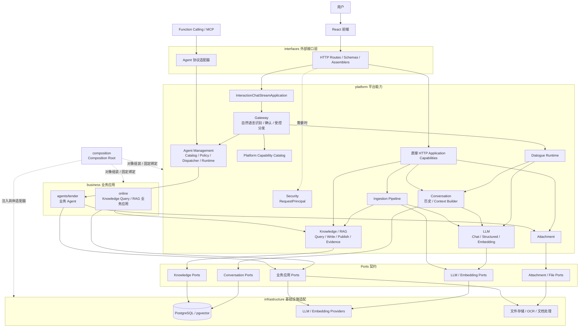
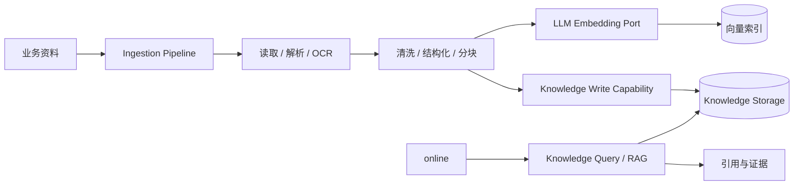
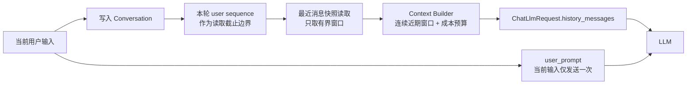
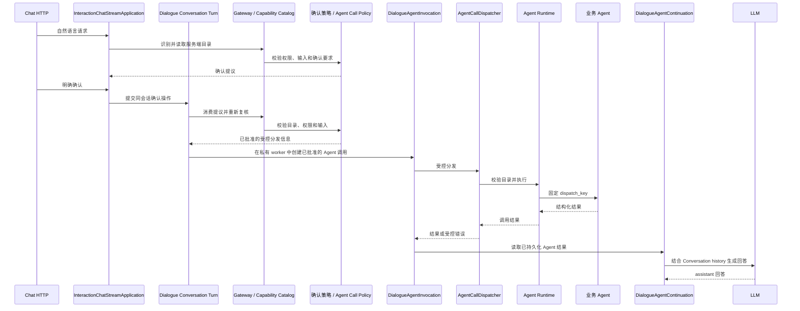

# Go Agent System 架构

> 本文档是系统技术架构的唯一基线，描述一份完整、稳定的设计。项目进度由系统看板记录，具体交付由 OpenSpec Change 管理；这些内容不在本文档重复维护。

## 1. 系统定位

Go Agent System 是一个面向 Agent 开发的平台型应用。平台提供 LLM、Knowledge/RAG、资料处理、对话、交互、Agent Management、附件和安全等可复用能力；业务应用在平台能力之上实现具体领域 Agent 与业务流程。

系统以两类输入为基础：一类是可检索、可追溯的业务资料，另一类是用户的自然语言请求。资料经过通用 Ingestion Pipeline 进入 Knowledge/RAG；用户可以通过直接业务接口使用能力，也可以通过自然语言 Chat 由 Gateway 识别能力并受控调用 Agent 或对话能力。

## 2. 架构边界

### 2.1 语义分层

```text
平台能力层 / Platform Capabilities
  LLM、Knowledge/RAG、Ingestion、Conversation、Dialogue、Interaction
  Agent Management、Attachment、Security

业务应用层 / Business Applications
  online、agents/tender

横向技术层 / Technical Layers
  interfaces、infrastructure、composition、shared
```

平台能力是可复用的系统能力，不绑定某个具体业务。业务应用组合平台能力，承载领域规则和业务输出。横向技术层为平台和业务提供协议、外部系统适配、对象组装以及共享基础设施。

### 2.2 物理分层

```text
外部调用者 / 前端 / Agent 协议
  -> interfaces
  -> platform 或 business 的 Application Capability
  -> Domain + Ports
  <- infrastructure adapters

composition 负责构造对象图、注入适配器和固定分发绑定。
shared 提供配置、日志、异常等不携带领域职责的共享基础能力。
```

依赖方向由内向外保持稳定：接口层依赖应用契约，应用层依赖本模块 Domain 与 Ports，基础设施实现 Ports。Domain 不依赖 HTTP、ORM、数据库、模型 SDK 或具体 Agent 框架。应用模块不把路由、Schema、SQL 和 Provider 调用混在同一职责中。

### 2.3 请求入口

系统保留两种运行时入口：

1. 直接 HTTP 路由：知识、资料、会话、附件和业务能力等接口由对应的 Application Capability 直接处理。Security 在需要时解析并提供 `RequestPrincipal`，但这些请求不经过 Gateway。
2. 自然语言 Chat：Chat HTTP 请求进入 `InteractionChatStreamApplication`，再由 Gateway 识别候选能力、检查目录与策略、处理确认并进入 Dialogue 或 Agent 分支。

Gateway 是自然语言入口的控制面，不是所有 HTTP API 的中转层。Composition Root 只负责对象组装，不参与请求转发。

## 3. 总体结构



图中的实线表示运行时调用或能力使用，虚线表示组装关系。`Direct` 是对直接 HTTP 应用能力的概念归纳，具体路由仍位于 `interfaces/http/routes/`，并分别调用对应的平台或业务用例。

## 4. 平台能力

### 4.1 LLM

LLM 是通用、无状态的模型能力，提供：

- 文本 Chat 与流式 Chat。
- 结构化输出及 Schema 校验。
- 文本 Embedding。
- Provider 配置、请求治理、超时、重试和标准化错误。

LLM 不负责会话历史、意图识别、能力授权、业务规则、Agent 分发或附件生命周期。具体 Provider SDK 只出现在 `infrastructure/llm/`，上层通过 LLM Ports 和稳定契约调用。

### 4.2 Knowledge / RAG

Knowledge 是独立的平台知识能力，负责知识查询、向量与关键词检索、结果融合、排序、知识写入、版本发布、引用和证据表达。RAG 使用 Knowledge 提供的检索证据，再由业务应用通过自己的应用契约生成领域回答。

Knowledge 不拥有某个业务应用的判断规则。检索结果保留文档、版本、章节、页码和原文片段等来源信息；没有足够证据时，调用方返回资料不足，不生成无依据的业务结论。

### 4.3 Ingestion

Ingestion 是平台级通用资料处理 Pipeline，负责接收资料并编排文件读取、格式解析、OCR、文本清洗、结构提取、分块、Embedding 和写入 Knowledge 的过程。

政策资料是该 Pipeline 的代表性验证样本，不构成 Ingestion 的业务边界。具体资料类型通过 Pipeline 的输入契约和适配器扩展，不需要为每类资料复制一套平台模块。



### 4.4 Conversation 与 Context

Conversation 是会话事实、消息、事件、访问范围和上下文构建的边界。它负责会话生命周期、历史读写、主体范围校验和把有序消息转换为模型中立的上下文。面向模型上下文的读取使用独立的最近消息快照能力；面向用户恢复历史的正向分页仍保持原有契约。

多轮请求的上下文设计如下：



普通流式 Chat 在既有 Conversation 轮次租约内先持久化本轮 user Message，再以其 `sequence` 作为包含截止边界读取最近消息快照。快照读取只返回当前 Conversation 中不晚于该边界的有界窗口，不扫描完整历史；用户恢复历史使用独立的正向分页能力。Context Builder 再在快照内选择连续的近期消息后缀，使用 `max_messages=20` 和 `max_cost=12_000`。历史消息保留原始角色和顺序；当前用户输入不重复放入 `history_messages`，只作为 `user_prompt` 发送一次。LLM 只消费本次请求提供的上下文，不自行持久化会话记忆。

### 4.5 Dialogue

Dialogue Runtime 编排一轮对话，连接 Conversation、Context Builder、Interaction 和 LLM。它负责持久化本轮用户消息、Agent 调用事件、Agent 结果以及最终 assistant 消息，并在需要时将 Agent 结果转换为同一会话中的自然语言回答。

同一 Conversation 的普通流式对话和已确认 Agent 调用共享由 Dialogue 持有的进程内轮次租约；租约覆盖本轮事实写入至最终终态。已确认 Agent 的同步执行与续写在每轮私有 worker 中完成，不复用 HTTP 请求的持久化资源，因此不同 Conversation 可以继续推进。Interaction 仍负责提议消费、目录、权限和输入复核，只把服务端产生的批准分发信息交给该轮次。

普通流式 Chat 的同步 Conversation Access、消息写入和最近消息读取通过异步持久化边界进入独立 worker。每个短操作使用独立的 Session，完成提交或回滚后立即关闭；Provider 流期间不持有 Conversation Session 或数据库连接。该边界只隔离同步持久化操作，不改变既有轮次租约，也不引入第二套锁或长事务。

Dialogue 不拥有认证主体，也不绕过 Conversation Access 或 Interaction 的授权检查。普通对话和 Agent 结果续写都使用统一的上下文请求契约。

### 4.6 Interaction 与 Gateway

Interaction 是自然语言交互控制面，包含意图识别、平台能力目录、确认提议、输入校验、调用策略和受控分发。Gateway 的处理顺序为：

```text
用户输入
  -> 确定性规则与安全检查
  -> Platform Capability Catalog 召回候选
  -> 候选范围内的结构化意图识别
  -> 服务端目录、参数、权限和确认策略复核
  -> 澄清 / 确认提议 / 直接执行
  -> 固定分发到目标 Application Capability
```

模型输出只提供识别结果，不构成执行权限。客户端提交的能力代码、分发键、权限和文件路径也不构成执行权限；所有执行目标都必须由服务端目录重新读取并校验。

### 4.7 Agent Management

Agent Management 是平台对 Agent 能力进行登记、发现、授权和运行时调用管理的能力。其受控结构包括：

- `Platform Capability Catalog`：统一记录可用能力的类型、输入契约、权限、确认策略和分发键。
- `Agent Call Policy`：结合当前主体、目录条目、输入和批准信息判断是否允许调用。
- `AgentCallDispatcher`：执行策略通过且仍与服务端目录一致的 Agent 调用。
- `Agent Runtime`：根据目录中的固定分发绑定调用业务 Agent，不维护第二份注册表。

自然语言 Agent 调用链路如下：



### 4.8 Attachment

Attachment 负责上传、访问绑定、读取和文件存储边界。它为 Conversation 和业务 Agent 提供受主体约束的附件引用；文件内容、路径和存储实现不进入 Domain 或 HTTP 之外的业务契约。

### 4.9 Security

Security 通过 `PrincipalResolverPort` 将服务端可信上下文解析为 `RequestPrincipal`，供 Interaction、Conversation 和 Attachment 进行权限与资源归属校验。主体、权限和资源 owner 是不同概念：权限决定能力是否可调用，主体决定资源访问范围，业务模块不能信任客户端提交的授权字段。

## 5. 业务应用

### 5.1 online

`app/business/online/` 是使用平台 Knowledge/RAG 的业务应用。它通过 Knowledge Query Capability 获取检索证据，通过自身的 `AnswerGenerator` Port 生成业务回答，并提供规则检索、材料核验和结构化判断等业务用例。

Online 不拥有通用 RAG 引擎，也不直接依赖某个 LLM Provider。回答生成适配器由 Composition Root 绑定，业务应用只依赖自己的 Port 和 Knowledge 的稳定查询契约。

### 5.2 agents/tender

`app/business/agents/tender/` 是业务 Agent 实现。它通过自身的 Application、Domain 和 Ports 完成招标文档读取、结构化分析、分块处理、投标骨架规划和文档渲染；它使用 Attachment、文档读取、渲染和结构化 LLM 契约。

Tender 是 Agent Management 所管理的一项业务能力，不是平台一级能力，也不与 Knowledge/RAG 建立未经定义的直接依赖。

## 6. 接口与适配器边界

### 6.1 HTTP 与 Agent 协议

```text
HTTP / MCP / Function Calling
  -> interfaces adapter
  -> Application Command / Query
  -> Platform 或 Business Capability
  -> Domain + Port
  -> Infrastructure Adapter
```

`interfaces/http/` 负责路由、协议 Schema、Assembler、依赖注入和异常映射；`interfaces/agent/` 负责 MCP、Function Calling 等协议适配。协议适配器只能调用应用能力，不得直接访问 Repository、数据库或 Provider SDK。

### 6.2 基础设施

`infrastructure/` 实现平台和业务 Ports，包括：

- `persistence/`：SQLAlchemy、Session、Repository 和持久化模型。
- `llm/`：Chat、结构化输出、Embedding Provider 适配器及请求治理。
- `documents/`：DOCX 等具体文档读取与渲染。
- `ocr/`：OCR Provider 适配器。
- `filesystem/`：上传、附件和文件存储。

具体适配器不反向编排业务用例，不把外部 SDK 类型泄漏到应用层。

## 7. 前端架构

前端是独立的 React/TypeScript 应用，通过稳定 HTTP API 使用平台和业务能力。它负责页面交互、请求状态、上传进度、错误处理、重试、下载和结果展示，不访问数据库、Repository、Domain Entity、Provider 或 Agent Runtime 内部实现。

技术选型为 React 18、严格模式 TypeScript、Vite、Ant Design、Axios、TanStack React Query、React Router、Zod、Vitest、React Testing Library 和 Playwright。

```text
frontend/src/
├── app/                    # router、providers、应用配置
├── layouts/                # 工作台布局
├── features/               # chat、knowledge-base、agent/tender 等业务界面
├── services/http/          # Axios 客户端和 HTTP 类型
├── shared/                 # 通用组件、常量、类型和工具
├── styles/                 # 主题与全局样式
└── main.tsx
```

页面通过 React Query Hook 调用业务 API，Axios Client 统一处理 `/api` 前缀、超时、错误转换和上传进度。页面组件不直接编排 HTTP 请求或后端业务规则。

## 8. 后端物理结构

```text
app/
├── platform/
│   ├── agent/              # Agent Runtime
│   ├── attachment/         # 附件契约、访问与存储边界
│   ├── conversation/       # 会话、消息、事件与上下文
│   ├── dialogue/           # 对话与 Agent 结果续写
│   ├── ingestion/          # 通用资料处理 Pipeline
│   ├── interaction/        # Gateway、目录、确认与分发
│   ├── knowledge/          # Knowledge/RAG 查询、写入与发布
│   ├── llm/                # LLM 契约与应用能力
│   └── security/           # RequestPrincipal 与安全端口
├── business/
│   ├── online/             # Knowledge/RAG 业务应用
│   └── agents/tender/      # Tender 业务 Agent
├── interfaces/
│   ├── http/               # HTTP routes、schemas、assemblers
│   └── agent/              # Function Calling / MCP 适配器
├── infrastructure/        # 数据库、Provider、OCR、文件和文档适配器
├── composition/            # Composition Root 与固定绑定
└── shared/                 # 配置、日志、异常和共享基础能力

frontend/                   # React / TypeScript 前端
tests/                      # 单元、应用、协议和架构边界测试
openspec/                   # 需求变更与交付产物
docs/                       # 看板、设计说明和业务资料
tools/                      # 人工诊断、验收和样本处理脚本
sql/                        # 数据库初始化与结构脚本
docker/                     # 本地基础设施配置
.runtime/                   # 本地运行产物，不提交到 Git
```

## 9. 质量与安全约束

- 领域层不依赖外部协议、数据库、模型框架或具体基础设施。
- 所有 Agent 调用经过服务端能力目录、主体权限、输入契约和确认策略校验。
- RAG 和业务判断保留来源信息；证据不足时返回受控结果。
- 外部模型、Embedding、OCR 和文件系统通过 Port 接入，并使用稳定替身进行自动化测试。
- 密钥、数据库凭据、真实业务资料和运行产物不得提交到 Git；运行时文件放入 `.runtime/`。
- 架构边界通过 AST 或依赖扫描测试验证，不能只依赖目录名称。
