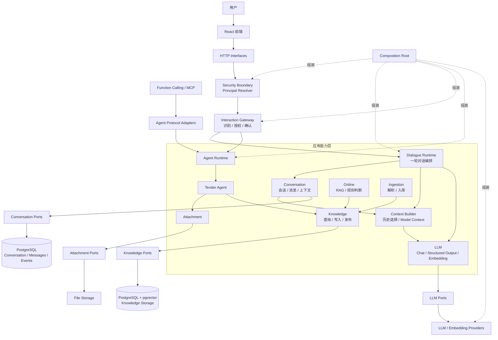
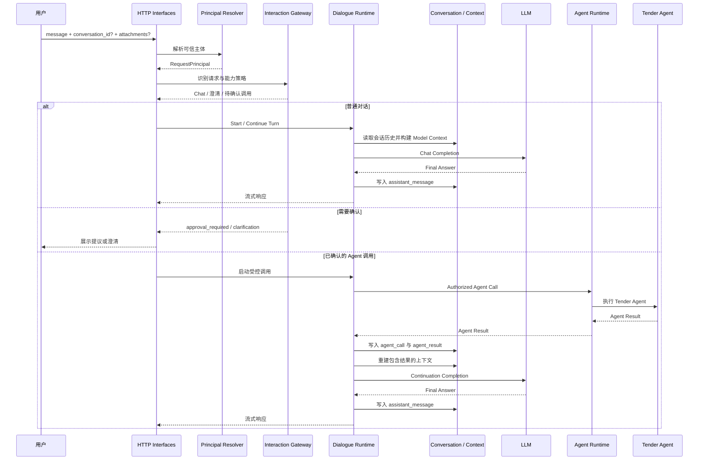

# 当前系统架构基线

> 状态：当前唯一架构基线。最后整理：2026-08-21。
>
> 本文档覆盖后端、LLM 对话体系和前端工程。新的 Change、设计与实现以本文为准。
>
## 目录

1. 后端架构
   - 当前能力状态
   - 核心原则
   - 分层定义与依赖方向
   - 总体结构
   - 后端能力边界
   - 多轮对话与 Agent 请求流程
   - HTTP 契约与适配边界
   - 后端物理结构
2. 前端架构
   - 定位与技术选型
   - 前端分层
   - 请求、状态与类型
   - 页面与能力边界
   - 视觉与可用性约束
3. 当前范围外与演化规则
4. 质量、安全与验证

## 1. 后端架构

### 1.1 当前能力状态

| 范围 | 当前状态 | 说明 |
|---|---|---|
| 知识库与入库 | 已实现 | 文档接入、解析、OCR、清洗、切分、向量化、发布、检索、引用和证据不足处理。 |
| Online RAG 与规则判断 | 已实现 | 通过知识查询能力提供检索、问答与规则场景结果。 |
| LLM 能力 | 已实现 | 无状态 Chat、结构化输出、纯文本 Embedding 和 Provider 适配。 |
| Conversation | 已实现基础 | 会话、消息、Turn、事件、历史读取/写入和首版 Context Builder。 |
| Dialogue Runtime | 已实现基础 | 多轮普通对话、Agent 调用、Agent 结果续写。 |
| Interaction Gateway | 已实现基础 | 候选识别、能力策略、显式确认、受控分发、流式对话入口。 |
| Tender Agent 与附件 | 已实现当前链路 | 已授权的 Tender 调用、动态附件解析、上传、访问绑定与结果下载。 |
| 请求主体插口 | 已实现 Mock | HTTP 注入 `RequestPrincipal`，可使用匿名或静态 resolver；没有真实用户模块。 |
| 会话 owner 隔离 | 未实施 | `owner_subject + conversation_id` 的存储和访问校验是下一步独立 Change。 |
| 真实认证、授权和用户模块 | 未实施 | JWT、Session、SSO、用户表与权限服务均不在当前范围。 |
| Redis、上下文压缩、长期摘要 | 未实施 | PostgreSQL 保持长期事实源；缓存与压缩另行设计。 |
| SubAgent、Workflow、Task Management、Harness | 未实施 | 仅保留扩展边界，不提前决定其运行时实现。 |

### 1.2 核心原则

1. **能力独立。** LLM、Conversation、Interaction、Agent、Knowledge、Ingestion、Attachment 和 Security 是边界清晰的能力；一个能力不得借由另一个能力的内部实现完成职责。
2. **依赖向内。** 外部接口调用应用能力；应用能力通过 Domain 和 Ports 定义需要的契约；基础设施从外部实现 Ports；`app/composition/` 统一选择并组装实现。
3. **协议与业务分离。** HTTP、Function Calling 和 MCP 是适配协议，不是 Domain 模型。HTTP Schema、前端类型和 Provider SDK 不得泄漏到应用层和领域层。
4. **安全与编排分离。** Security 解析可信主体，Interaction 校验能力调用，Conversation 负责资源归属。Dialogue 只编排一轮，不能独占或绕过安全检查。
5. **证据优先。** RAG 与业务判断必须追踪来源；缺少有效证据时返回资料不足，不生成无依据结论。
6. **渐进演化。** 没有真实需求时，不引入 LangGraph 复杂编排、SubAgent、Workflow、Redis、MongoDB 或压缩 Worker。

### 1.3 分层定义与依赖方向

```text
外部调用者 / 前端
  -> Interfaces（HTTP / Agent Protocol Adapter）
  -> Security Boundary（可信主体解析）
  -> Application Capabilities（业务用例与一次请求编排）
  -> Domain + Ports（业务规则与所需能力契约）
  <- Infrastructure Adapters（数据库 / LLM / OCR / 文件系统）

Composition Root 横向组装全部具体实现。
```

| 层级 | 职责 | 允许依赖 | 禁止事项 |
|---|---|---|---|
| Interfaces | HTTP 路由、Schema、Assembler、依赖注入、协议异常映射 | Application Command/Query/Result；Security resolver | 业务规则、SQL、LLM SDK、ORM 细节。 |
| Security Boundary | 将服务端可信上下文解析成 `RequestPrincipal` | HTTP 请求上下文、配置、认证适配器 | 信任客户端提交的权限、角色、能力代码或分发键。 |
| Application Capabilities | 用例编排、状态转换、调用 Ports、跨能力协调 | 自己的 Domain、Ports、稳定的其他能力契约 | FastAPI、`UploadFile`、ORM、具体 Provider SDK。 |
| Domain + Ports | 业务对象、不变量、Ports 和内部契约 | 同模块 Domain 类型 | HTTP、数据库、LangChain、LangGraph、具体文件/模型客户端。 |
| Infrastructure | 实现 Repository、LLM、Embedding、OCR、文件存储等 Ports | Ports、配置、外部 SDK | 反向编排业务用例，或成为业务模块依赖。 |
| Composition Root | 选择适配器、构造对象图、注册依赖 | 所有具体实现和公开构造器 | 放业务规则、HTTP 协议或领域判断。 |

下列规则长期有效：

- `online` 与 `ingestion` 不直接依赖；二者通过 Knowledge Capability 协作。
- Agent 适配器和 Agent 业务能力必须调用 Application Capability 或 Port，不得直连 Repository、数据库或模型 SDK。
- Interaction 的能力候选索引与政策知识库索引必须分离；它们可以共享 Embedding Provider，不能共享领域模型或 Repository。
- 前端仅访问稳定 HTTP API，不访问数据库、Repository、Domain Entity、LLM Provider 或 Agent Runtime 内部实现。

### 1.4 总体结构



### 1.5 后端能力边界

#### 1.5.1 LLM

`modules/llm` 是通用、无状态的模型能力，不属于任何 Agent。它负责：

- Chat Completion、结构化输出及 Schema 校验。
- 纯文本的单条/批量 Embedding。
- Provider 配置、超时、重试和标准化错误契约。

它不负责会话历史、用户意图、能力授权、业务规则、Function Calling 执行、MCP 会话或 Agent 编排。`infrastructure/llm` 只实现 LLM Ports，SDK 和 LangChain 细节不能泄漏到上层。

#### 1.5.2 Conversation 与 Context

Conversation 是会话历史和长期事实的边界，当前负责 `Conversation`、`Message`、`Turn`、`ConversationEvent`、历史读写和有序上下文构建。

```text
Conversation History
  -> Context Policy（选择有业务意义的历史）
  -> Model Budget Adapter（Provider / Token 约束）
  -> Model Context
  -> Chat Model Port
```

`Context Builder` 属于 Conversation 应用能力，不属于 LLM 内部。LLM Adapter 仅消费本次调用的 `Model Context`，不自行保存记忆。普通单轮模型调用也不得隐式创建 Conversation。

当前使用 PostgreSQL 保存会话、消息和事件。未来可以引入 Redis 作为热上下文或短 TTL 缓存，但不得替代 PostgreSQL 的长期事实源；摘要检查点、上下文压缩和异步 Compaction Worker 需要独立 Change。

#### 1.5.3 Dialogue Runtime

Dialogue Runtime 编排一轮对话，连接 Conversation、Context Builder、Interaction Gateway、LLM 和 Agent Runtime。它负责在恰当位置记录用户消息、模型回答、Agent 调用和 Agent 结果。

它不拥有用户认证、权限来源或会话所有权规则。后续接入 owner 隔离后，Dialogue 只能使用已通过 Conversation Access 验证的会话，不能仅凭客户端 `conversation_id` 读取或写入历史。

#### 1.5.4 Security 与主体边界

`PrincipalResolverPort` 是将来用户模块的插口。HTTP 层从服务端上下文解析 `RequestPrincipal` 并注入 Interaction/Agent 调用链；当前可使用匿名或静态 resolver 作为 Mock。

```text
HTTP 请求
  -> PrincipalResolverPort
  -> RequestPrincipal(subject, permissions, authenticated)
  -> Interaction Gateway / Dialogue / Attachment
```

字段责任必须分开：

| 字段 | 用途 | 当前/未来规则 |
|---|---|---|
| `subject` | 资源归属的稳定、不透明标识 | 未来作为 `Conversation.owner_subject` 和附件归属的键；不等同于展示名。 |
| `permissions` | 能力调用授权 | 由 Interaction Gateway 按服务端目录校验；不是资源归属依据。 |
| `authenticated` | 持久化会话等准入信号 | 真实用户模块接入后由认证适配器决定。 |

当前还没有 User 表、JWT、Session、SSO 或 owner-scoped Conversation Access。未来会话读写必须同时以 `owner_subject + conversation_id` 查询；客户端 UUID、请求体权限、角色和模型输出都不能构成授权依据。未来用户模块只替换 resolver，不改变 Dialogue、Conversation、Gateway 的契约方向。

#### 1.5.5 Interaction Gateway 与能力目录

Interaction 是面向自然语言入口的统一控制面。它负责确定性规则、候选召回、结构化意图识别、参数复核、权限校验、澄清、显式确认和受控分发。

```text
用户输入
  -> 确定性规则（确认 / 取消 / 输入安全）
  -> Platform Capability Catalog 召回候选
  -> 在候选范围内的 Structured LLM 识别
  -> 代码校验参数、权限、确认策略
  -> 澄清或展示待执行提议
  -> 用户显式确认
  -> Controlled Dispatcher 固定映射到目标能力
```

`Platform Capability Catalog` 是平台可调用能力的唯一目录，覆盖 Agent 和非 Agent 能力。目录项包含稳定能力代码、输入输出 Schema、启用状态、权限、确认策略、超时、错误边界及固定分发目标。LLM 只能在已召回候选中产生受约束的结构化结果，不能生成 URL、类名、工具名或目录外能力代码，也没有直接调用 Agent 的权限。

确认提议可以使用短 TTL、一次性消费的 `Proposal Store`，但该状态不等同 Conversation 或 Task。跨会话恢复、持久化审批和异步执行需要各自独立演化。

#### 1.5.6 Agent Runtime、Tender 与外部协议

Agent Runtime 在授权后的受控分发中执行 Agent Call，并负责将结果返回给 Dialogue。Tender 是具体业务 Agent，输入、输出、附件引用、超时和失败由自身应用契约定义。

- Agent 可使用 LLM、Knowledge、Attachment 和外部服务，但不重复实现 LLM Chat。
- 一个 Agent 不等于一个 Chat 页面；是否对话式交互由产品用例和后端契约决定。
- Function Calling、MCP 是协议适配器，最终必须落到 Application Capability 或 Agent Port，不得直接操作 Repository、数据库或 Provider Client。
- LangGraph 未来可作为 Agent Runtime Adapter，但 Domain、LLM Port 和具体 Agent 不得依赖它。

SubAgent、Workflow、Task Management 与 Harness 都尚未实现。Task Management 将来只负责任务 ID、状态、重试、幂等和恢复，不负责会话上下文、LLM 调用或业务编排。

#### 1.5.7 Knowledge、Ingestion、Online 与 Attachment

| 能力 | 职责 | 关键约束 |
|---|---|---|
| Knowledge | 知识查询、写入、发布、检索策略与来源追踪 | 通过 Read/Write/Publication Ports 访问存储。 |
| Ingestion | 文件接入、解析、OCR、清洗、切分、向量化和入库 | 依赖端口，不直接耦合 Online。 |
| Online | RAG 问答、规则获取、数据获取和业务结果编排 | 通过 Knowledge Capability 检索，不直接访问向量库。 |
| Attachment | 临时文件、上传、访问绑定、应用输入解析和下载 | 文件流仅停留在 HTTP/Adapter 边界；业务能力消费稳定的文件引用。 |

知识检索返回来源文档、版本、章节、页码和原文片段。`ask` 在没有有效证据时必须拒绝生成无依据结论。Checklist 场景属于 `modules/online/domain/checklist`；它经 Online Application 调用 Knowledge Query，而不直接访问 Repository。

能力目录的意图索引回答“用户想使用什么能力”，政策/知识检索回答“哪些资料支持结论”。这两个索引必须拥有独立领域模型、Repository 和数据集，不能混用。

### 1.6 多轮对话与 Agent 请求流程

浏览器对话的统一入口是 `POST /api/v1/interaction/chat/stream`。旧 `/api/v1/llm/chat` 及其流式变体已经退场，不保留兼容入口。



附件上传与使用遵循独立链条：

```text
文件选择
  -> HTTP Upload Adapter
  -> 临时或受控附件引用
  -> 当前主体/会话访问绑定
  -> Interaction Attachment Resolver 校验
  -> Tender 输入适配
  -> Agent 结果与可下载产物
```

上传界面不会把浏览器 `File` 或 multipart 对象传入领域层；Tender 也不能信任由客户端构造的文件路径或附件归属。

### 1.7 HTTP 契约与适配边界

```text
前端
  -> Request Schema / Route
  -> HTTP Assembler
  -> Application Command / Query
  -> Capability / Use Case
  -> Port
  -> Repository / Provider

Repository / Provider
  -> Application Result
  -> HTTP Assembler
  -> Response Schema
  -> 前端
```

| 对象 | 所属位置 | 约束 |
|---|---|---|
| Request / Response Schema | `app/interfaces/http/schemas/` | 只描述 JSON、multipart、path/query 和响应协议；不传入应用层。 |
| Route | `app/interfaces/http/routes/` | 依赖注入、调用用例、异常映射；不编排业务。 |
| HTTP Assembler | `app/interfaces/http/assemblers/` | HTTP Schema 与 Application Command/Result 互转；不含业务规则。 |
| Application Command / Query / Result | `app/modules/*/application/` | 可被多个适配器使用；不依赖 FastAPI 或前端类型。 |
| Port | `app/modules/*/ports/` | 由内层定义、由基础设施实现。 |

知识库管理、检索、上传预览、正式入库、发布和入库重试都通过独立 HTTP 契约接入。管理列表与详情使用 Application Read Model，不把页面字段加入 Domain Entity；`hits`、`citations`、`debug` 是 HTTP 展示契约，而召回、融合、rerank 仍属于 Knowledge Retrieval。

### 1.8 后端物理结构

```text
app/
├── modules/
│   ├── agent/              # Agent Runtime 与具体 Agent（当前含 tender）
│   ├── attachment/         # 附件契约与访问/解析边界
│   ├── conversation/       # 会话、消息、事件、上下文
│   ├── dialogue/           # 单轮对话编排与 Agent 续写
│   ├── ingestion/          # 文档解析与入库
│   ├── interaction/        # 意图、目录、确认、分发与流式交互
│   ├── knowledge/          # 知识查询、写入、发布、检索
│   ├── llm/                # 通用模型与 Embedding 能力
│   ├── online/             # RAG 与规则判断
│   └── security/           # RequestPrincipal 与 resolver Port
├── interfaces/
│   ├── http/               # routes、schemas、assemblers、dependencies
│   └── agent/              # Function Calling / MCP 等协议适配器
├── infrastructure/
│   ├── documents/          # 文档处理具体实现
│   ├── filesystem/         # 文件与附件存储适配器
│   ├── llm/                # Provider / SDK 适配器
│   ├── ocr/                # OCR 适配器
│   └── persistence/        # ORM、Session、Repository、迁移支持
├── composition/            # ApplicationContainer 与对象组装
└── shared/                 # 配置、日志、异常与少量基础类型

frontend/                   # 独立 React / TypeScript 应用
tests/                      # 模块测试、基础设施测试、架构边界测试和测试支持
```

禁止重新引入 `app/api`、`app/services`、`app/repositories`、`app/schemas` 等按技术横切堆放业务代码的旧目录。新增目录或跨模块依赖需要先更新架构基线并通过 Change 评审。

## 2. 前端架构

### 2.1 定位与技术选型

前端是独立应用层，通过稳定 HTTP API 使用平台能力。它负责页面交互、请求状态、上传进度、错误、重试、下载和结果展示；不依赖或感知 GLM、LangChain、LangGraph、MCP、Repository、数据库或后端编排实现。

| 范围 | 选型 / 规则 |
|---|---|
| 框架与语言 | React 18、TypeScript，开启 `strict: true`。 |
| 构建 | Vite，复用现有 `frontend` 工程，不创建第二套前端包。 |
| UI 与图标 | Ant Design 5、`lucide-react`。 |
| 路由 | React Router。 |
| HTTP | Axios 统一客户端；不在页面组件直接创建请求，也不额外包装原生 `fetch`。 |
| 服务端状态 | TanStack React Query。 |
| 表单 | Ant Design Form + Zod。 |
| 样式 | Ant Design Token + CSS Modules。 |
| 测试 | Vitest + React Testing Library；关键链路使用 Playwright。 |

### 2.2 前端分层

```text
frontend/src/
├── app/                    # router、providers、应用配置
├── layouts/                # 工作台布局
├── features/
│   ├── chat/               # 通用对话页面、hooks、API、类型
│   ├── knowledge-base/     # 知识库管理、上传、检索
│   └── agent/
│       └── tender/         # Tender 的页面、组件、hooks、API、类型
├── services/http/          # Axios client、错误处理、请求类型
├── shared/                 # 通用组件、常量、类型、工具
├── styles/                 # theme 与全局样式
└── main.tsx
```

现有 `features/mock-workspace/` 可以作为正式 UI 基线逐步拆分；只替换 Mock 数据、行为与状态来源，不要求先废弃已有界面。业务模块通过公开 API 或 `shared` 交互，不跨 feature 引用内部文件。

### 2.3 请求、状态与类型

```text
Page Component
  -> React Query Hook
  -> Business API
  -> Axios Client
  -> Backend API
```

| 状态类型 | 管理方式 | 约束 |
|---|---|---|
| 输入框、弹窗、Tab | React State | 仅限组件局部交互。 |
| 服务端数据 | React Query | 负责缓存、重试、失效与轮询。 |
| 上传进度 | Axios 回调 + 组件状态 | 需要取消时使用 `AbortSignal`。 |
| 跨页临时状态 | 必要时 Zustand | 不默认建立全局业务状态。 |

所有 API 都经统一 Axios Client：统一 `/api` 前缀、超时、请求头注入、错误转换、开发日志和上传进度。业务 API 描述接口，Hook 管理页面状态，组件不直接处理 HTTP 错误对象。

TypeScript 不使用默认 `any`；请求和响应分别建模；组件 Props 必须声明类型；API 错误使用统一错误类型；区分浏览器 `File` 和后端附件/文档记录。前端认证信息的请求拦截器仅作为适配插口，不能自行决定权限。

### 2.4 页面与能力边界

| 页面/模块 | 路由 | 前端职责 |
|---|---|---|
| 通用对话 | `/chat` | 发送消息、选择/上传附件、展示流式回复、确认、错误与重试。 |
| Agent 工作台 | `/agents` | 展示可用 Agent 与运行状态。 |
| Tender | `/agents/tender` 及任务详情 | 收集业务输入、展示进度、结果预览与下载。 |
| 知识库 | `/knowledge-bases` 及子页面 | 管理知识库、文档、处理状态、重试和检索结果。 |
| Workflow | `/workflow` | 仅预留入口；不因路由存在而假定 Workflow 已实现。 |

知识库是平台共享能力，不归属 Tender。Agent 页面只消费后端 Agent/Application API，不承担 Agent Runtime、工具执行或模型调用。通用 Chat 与 Agent 任务页面独立；只有后端为某个 Agent 定义会话契约时，才增加相应的对话式 UI。

知识库页面支持管理列表、表单校验、批量/拖拽上传、进度、处理状态、失败重试、删除确认、文档详情、检索结果和空状态。文档解析、向量化、索引和持久化仍在后端。

### 2.5 视觉与可用性约束

- 工作台以高信息密度、清晰扫描和重复操作效率为主；深色侧栏承载导航，内容区保持可读。
- 卡片使用弱边框和清晰层级，不堆叠装饰性卡片；状态色明确区分成功、处理中和失败。
- 图标优先使用 `lucide-react`；图标按钮提供可理解的 tooltip。
- 页面必须覆盖 loading、empty、error、retry、upload progress 和 download 状态；文本在桌面与移动端均不得溢出或遮挡。
- 前端测试至少覆盖核心交互，所有前端改动运行 `npm run build`；上传、任务和下载等跨界链路由 Playwright 覆盖。

## 3. 当前范围外与演化规则

下列能力均需独立小 Change，且不得反向修改当前模块职责：

1. **会话 owner 隔离。** 实现 `Conversation.owner_subject`、Conversation Access 和仓储层 `owner_subject + conversation_id` 条件；先验证不同行主体不能读取或追加彼此会话。
2. **真实认证与授权。** 实现 JWT、Session、SSO、用户模块或权限服务时，只替换 Security resolver 与授权适配器。
3. **上下文压缩。** 增加摘要检查点、上下文策略、token 预算与可恢复压缩流程，保持原始消息和摘要的可追溯关系。
4. **缓存。** Redis 仅用于可丢弃的热数据、短 TTL Proposal 或速率控制；不得作为 Conversation 的事实源。
5. **多 Agent 编排。** 只有出现真实多步骤、分支、失败回退、可恢复状态或协作需求后，才选择 Workflow/Task/Agent Runtime Adapter。

每个 Change 要小到可以独立验证，不将认证、会话 owner、缓存、压缩和多 Agent 编排打包到同一改动中。

## 4. 质量、安全与验证

- 后端变更补充 `pytest`；前端变更至少运行 `npm run build`。
- 架构边界优先使用 AST/依赖扫描测试，而不是只检查目录名称。
- 外部模型、Embedding、OCR 和业务系统测试使用稳定替身、固定输出或明确 skip 条件。
- 敏感资料、密钥、真实业务文件与运行产物不得提交；运行时文件放入 `.runtime/`。
- 未经测试或人工验收，不得把实现描述为完成或通过验收。

常用检查：

```powershell
python -m pytest -q
ruff check app tests
python -m compileall -q app tests
Set-Location frontend
npm run build
```
