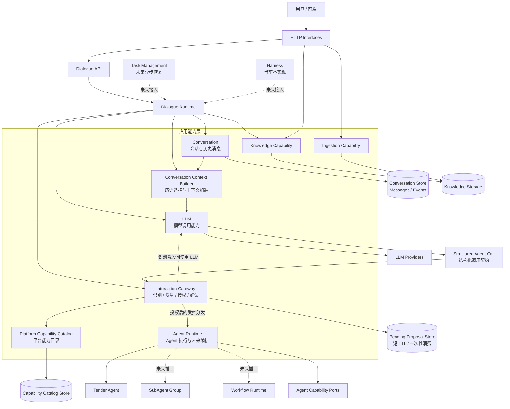
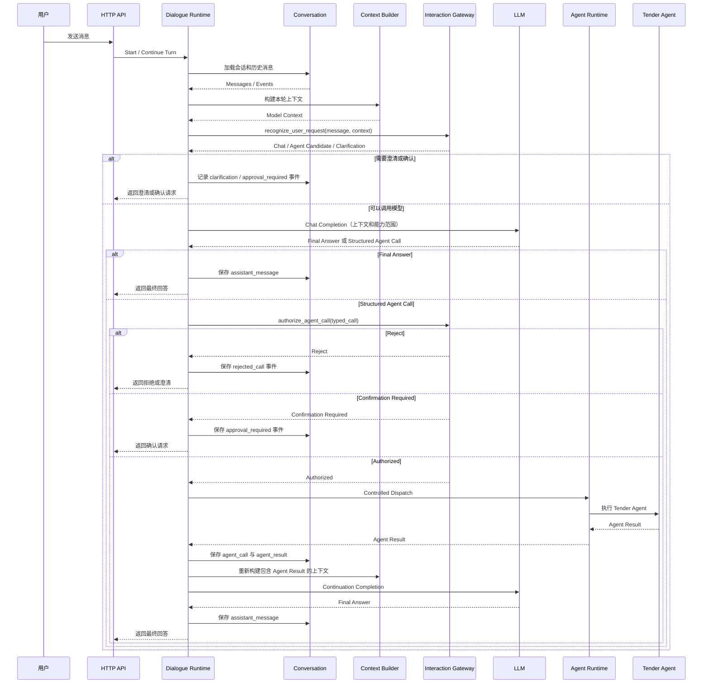

# 架构演化目标（V2：LLM 对话体系）

> 状态：已完成架构探索，尚未开始实现。
>
> V1 的已实现基线见 [ARCHITECTURE_V1.md](ARCHITECTURE_V1.md)。本文件只描述 V2 的目标架构、演化边界和实施顺序，不把 V2 内容回写为 V1 已实现事实。

## 目标与范围

V2 将 V1 的单轮/MCP 快速入口演化为完整的 LLM 对话体系，首要支持：

- Conversation、历史消息和多轮对话。
- 由 LLM 发起的单个 Tender Agent 调用。
- 显式的意图识别、能力授权和用户确认。
- 为 SubAgent、Workflow、Task Management 和 Harness 保留稳定插口。

V2 当前不实现 SubAgent、Workflow、Task Management 或 Harness。它们不能反向决定首版 Conversation 与 Dialogue 的模型。

## 最终模块归属

以下模块处于同一应用能力层级：

- `LLM`：无状态模型调用、结构化输出和 Provider 适配。
- `Conversation`：会话、消息、Turn、事件、历史持久化和恢复。
- `Dialogue Runtime`：编排一次对话轮次，连接 Conversation、LLM、Gateway 和 Agent Runtime。
- `Interaction Gateway`：统一进行用户请求识别、澄清、能力校验、权限判断和确认策略。
- `Agent Runtime`：执行已授权 Agent Call，并为未来编排提供运行时边界。

`Context Builder` 不属于 LLM 内部，也不是顶级业务模块。它是 Conversation 的应用能力，由 Dialogue Runtime 调用：

```text
Conversation History
  -> Context Policy（选择具备业务意义的历史）
  -> Model Budget Adapter（Token / Provider 限制）
  -> Model Context
  -> Chat Model Port
```

`Structured Agent Call` 是 LLM、Interaction Gateway 和 Agent Runtime 之间的类型化契约，不是新的顶级模块。

## 总体结构



## Gateway 的两个入口

```text
recognize_user_request(user_message, context)
  -> Chat / Agent Candidate / Clarification

authorize_agent_call(structured_agent_call)
  -> Reject / Confirmation Required / Authorized
```

用户自然语言必须先经 Gateway 识别、澄清和确认。模型产生结构化 `Agent Call` 后，Gateway 只做能力、Schema、权限和确认策略校验；不得把该对象再次转换为自然语言重新识别。

## 对话与 Agent 调用链路



## 代码层级目标

```text
app/
├── interfaces/http/
│   ├── routes/
│   │   ├── dialogue.py
│   │   ├── conversation.py
│   │   └── interaction.py
│   ├── schemas/
│   └── assemblers/
│
├── modules/
│   ├── llm/
│   │   ├── application/
│   │   ├── ports/
│   │   └── contracts.py
│   ├── conversation/
│   │   ├── domain/
│   │   ├── application/
│   │   └── ports/
│   ├── dialogue/
│   │   ├── domain/
│   │   ├── application/
│   │   └── ports/
│   ├── interaction/
│   │   ├── application/
│   │   └── ports/
│   └── agent/
│       ├── runtime/
│       └── tender/
│
├── infrastructure/
│   ├── llm/
│   ├── interaction/
│   └── persistence/
│       ├── models/
│       └── repositories/
│
└── composition/
    ├── conversation.py
    ├── dialogue.py
    ├── interaction.py
    └── agent.py
```

## 实施顺序

首个 Change 先做 Conversation，建议名称为 `conversation-foundation`。它为 Dialogue Runtime、上下文组装、Agent 结果回填和多轮恢复提供稳定基础。

`conversation-foundation` 包含：

- `Conversation`、`Message`、`Turn`、`ConversationEvent` 领域对象和标识。
- 会话创建、读取、消息追加、历史查询和顺序保证。
- `ConversationRepository`、`MessageRepository` 等持久化 Port 与基础实现。
- `ContextPolicy` 和 `ContextBuilder` 契约；首版只从历史生成有序 `ModelContext`，不调用具体模型。
- `conversation_id`、`turn_id`、`run_id`、`parent_run_id` 等关联标识。
- `approval_required`、`approval`、`agent_call`、`agent_result` 等扩展事件；Proposal 本体仍由 Gateway 的短 TTL 存储负责。

该 Change 不包含 Dialogue Runtime、Interaction Gateway 执行、Agent Runtime 改造、Task Management、Harness 或旧接口删除。

后续顺序固定为：

```text
1. conversation-foundation
2. dialogue-runtime
3. interaction-agent-call-authorization
4. 新对话入口验收后删除 /api/v1/llm/chat
5. SubAgent / Workflow / Task Management / Harness 的独立演化
```

## V1 退场规则

`/api/v1/llm/chat` 是 V1 为快速落地 MCP 链路建立的单轮入口。新 Dialogue API 完成验收后，必须一并删除：

- `app/interfaces/http/routes/llm.py`
- `app/interfaces/http/schemas/llm.py`
- 前端直接调用 `/api/v1/llm/chat` 的逻辑
- 对应的 V1 测试和兼容 Schema

保留并演化的是 `app/modules/llm/`，不是旧 HTTP 入口。
